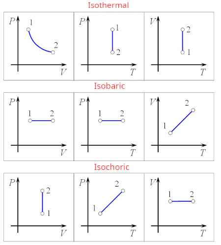
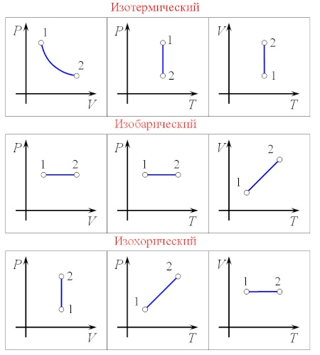

## Languages
+ [English](#зhysics-app)
+ [Русский](#приложение-по-физике)

# Physics app
This app is going to visualize some thermodynamic process based on input data (gas temperature, pressure, value). \
Some of the processes that are going to be visualized with different diagrams: **In development**
<!-- * Isobaric
* Isochoric
* Isothermal
* Adiabatic
* Polytropic -->
\

# Приложение по физике
Данное приложение будет визуализировать некоторые термодинамические процессы, основываясь на введеных параметрах (температура, давление, объем газа). \
Процессы, которые будут визуализированы при помощи разных графиков: **В разработке**
<!-- * Изобарный
* Изотермический
* Изохорный
* Адиабатный
* Поилитропный --> 
\

